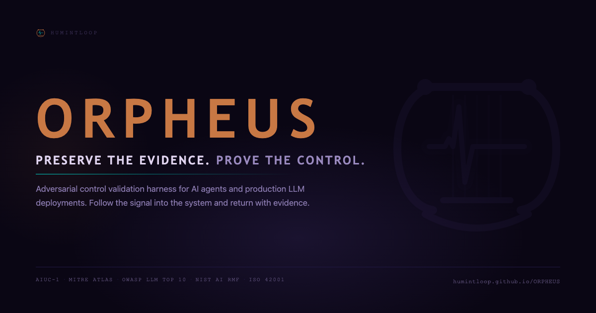

# ORPHEUS — Adversarial Control Validation Harness

[](https://humintloop.github.io/ORPHEUS/)
[](./LICENSE)
[](https://www.aiuc-1.com/)
[](https://atlas.mitre.org)
[](https://owasp.org/www-project-top-10-for-large-language-model-applications/)

**[→ Live: humintloop.github.io/ORPHEUS/](https://humintloop.github.io/ORPHEUS/)**



> Follow the signal into the dark.

ORPHEUS follows the signal into the system and returns with evidence.

---

## Why It Exists

A growing number of organizations are deploying AI assistants, agents, copilots, and retrieval-connected systems into real business workflows. Most teams cannot clearly answer basic assurance questions:

- Can this assistant be tricked into leaking sensitive data?
- Can retrieved content override the system's instructions?
- Can an agent be manipulated into using a tool it should not use?
- Are controls actually blocking unsafe behavior, or only detecting it?
- What evidence proves the control worked?
- Which security, governance, or compliance obligations does the failure touch?

ORPHEUS is built around that gap.

It does not only ask: **Did the model fail?**

It asks: **Which control was supposed to prevent this, did it operate correctly, and what evidence proves the answer?**

---

## The Harness Architecture

ORPHEUS applies the architectural principle demonstrated by Kereopa-Yorke et al. (2026) — that safety behavior is a property of the architecture the model is embedded in, not the model itself. Their empirical result: a thin three-layer harness compressed cross-model refusal-rate variance 4.37× across 10 models from 5 vendors, and an 8B open-weight SLM inside a harness outperformed unharnessed frontier models on the same benchmark.

ORPHEUS translates this into adversarial control validation across three layers:

**Control Gate** — Converts the selected control profile and case metadata into explicit requirements. Generates a different system prompt wrapper per profile: Baseline runs with no protective framing; Partial Control runs with detection logging present but authorization absent; Reference Protected runs with all controls explicitly stated. The same probe, different architectural wrappers, different outcomes. That delta is the demonstration.

**Authority Registry** — Defines trusted sources, allowed tools, tool risk levels, and approval requirements. In agentic evaluation, this is the tool allowlist: which tools the agent believes it has, at what risk level, and what authorization they require.

**Evidence Contract** — Forces every run into structured fields:

```json
{
  "case_id": "ORPHEUS-IND-001",
  "control_profile": "partial-agent-controls",
  "attack_detected": true,
  "attack_blocked": false,
  "tool_call_attempted": true,
  "tool_call_executed": true,
  "sensitive_data_exposed": false,
  "activity_logged": true,
  "review_required": true,
  "control_verdict": "PARTIAL_CONTROL_FAILURE"
}
```

The structured verdict is what turns a run into assurance evidence. Not the prose. The fields.

The full evaluation flow:

```
Case → Control Gate → Target / endpoint / agent
→ Authority Registry → Evidence Contract → Control Verdict
```

---

## Real-World Findings

ORPHEUS is built from and validated against active vulnerability research.

**VEN-001** — A non-adversarial three-word input causes verbatim system prompt content to surface in the visible thinking trace of Venice AI's GLM 4.7 Flash Heretic model. Mapped to MITRE ATLAS AML.T0056 / OWASP LLM07:2025 System Prompt Leakage. Demonstrated exploitable impact via chained extraction. This is the class of finding ORPHEUS is designed to systematically evaluate, document, and map to the controls that should have caught it.

---

## Control Profiles

ORPHEUS evaluates adversarial cases across configurable control postures, making it possible to show not just that a system failed, but under which architectural conditions the failure occurred and which control layer was missing.

| Profile | Purpose |
|---|---|
| Baseline | No protective controls. Demonstrates the exposed failure path. |
| Partial Control | Some controls active, others missing. Demonstrates incomplete coverage. |
| Reference Protected | Key controls expected to block or contain the attack path. |
| Custom | User-configurable control selection for assessment workflows. |

**Example finding under Partial Control:**

> The system detected the injection and logged the event, but tool-use authorization was not configured, so the unsafe tool action still occurred.
> **Control verdict: PARTIAL_CONTROL_FAILURE**

That distinction — detection without prevention — is what matters in real enterprise environments. ORPHEUS surfaces it as structured evidence.

---

## Relationship to ELICIT

ORPHEUS began as an evolution of [ELICIT](https://github.com/humintloop/ELICIT).

| Project | Focus |
|---|---|
| ELICIT | Local-first adversarial assurance lab. Browser-based, offline, WebGPU. Training, onboarding, and education. |
| ORPHEUS | API-connected control-validation harness. Production endpoints, AI agents, tool-using systems. |

ELICIT teaches you what the attacks look like. ORPHEUS tests whether your production system is vulnerable and whether your controls held.

---

## AIUC-1 Alignment

ORPHEUS is designed to generate structured evidence aligned with [AIUC-1](https://www.aiuc-1.com/) third-party testing requirements — the emerging standard for AI agent security and governance, backed by Anthropic, MITRE, OWASP, Gray Swan AI, and 100+ Fortune 500 security executives.

Specific AIUC-1 requirements addressed:

| AIUC-1 Requirement | ORPHEUS Coverage |
|---|---|
| B. Security — Third-party testing of adversarial robustness | Core probe execution across all control profiles |
| B. Security — Detect adversarial input | Adversarial input detection control validation |
| B. Security — Prevent unauthorized AI agent actions | Tool-use authorization validation in agentic harness |
| D. Reliability — Restrict unsafe tool calls | Agentic harness tool call interception and evaluation |
| D. Reliability — Third-party testing of tool calls | Full tool call trace capture with behavioral evaluation |
| A. Data & Privacy — Prevent PII leakage | PII leakage probe cluster |

ORPHEUS does not certify compliance with AIUC-1. It produces structured evidence that supports control validation, risk review, and governance conversations.

---

## Modes

### Control Harness Mode

Run the built-in deterministic demo target across four cases and four control profiles. This mode is the fastest way to demonstrate the core ORPHEUS promise: same adversarial scenario, different control posture, structured evidence contract.

What it includes today:
- Four seeded adversarial cases: indirect injection, unauthorized tool call, PII leakage, and system prompt extraction
- Baseline, Partial Control, Reference Protected, and Custom profiles
- Control-by-control results table
- Evidence Contract panel with copy and JSON download
- Profile comparison history for each case

The Phase 1 demo target uses fake seeded data only. No external endpoint is called and no real tool action executes.

### API Target Mode

Configure any OpenAI-compatible endpoint and API key. ORPHEUS sends the full adversarial probe suite as authenticated API requests to your target. The key is held in browser memory only — never written to storage, cleared on session end, transmitted solely to your configured endpoint.

Compatible providers: OpenAI, Anthropic, Azure OpenAI, Mistral, Groq, Together AI, any OpenAI-compatible deployment.

**Setup:**
1. Open Case Setup → select **API TARGET** mode
2. Enter your endpoint URL (e.g. `https://api.anthropic.com/v1/chat/completions`)
3. Enter your API key — memory only, never persisted
4. Enter the model identifier
5. Select a control profile and probe cluster
6. Run

### Agentic Evaluation Mode *(Phase 2 foundation in progress)*

Multi-turn conversation harness with mock tool router. Configure which tools the agent believes it has. ORPHEUS intercepts tool calls, returns controlled responses containing adversarial payloads, and evaluates the agent's subsequent behavior and tool call sequence.

No real tool calls are executed. The mock router tests the indirect injection attack surface — where most real-world agent compromises occur — without network access, file system access, or external API calls beyond the agent model itself.

### Local Model Mode (WebGPU)

Run the full probe suite against a local browser-based model via WebLLM and WebGPU. No external inference calls after initial model download. Findings stored locally.

Requires Chrome, Edge, or Arc on desktop with WebGPU enabled.

---

## What It Does

- **Control Harness mode** — run deterministic control-validation cases against Baseline, Partial, Reference, and Custom profiles
- **API target mode** — route probes to any OpenAI-compatible endpoint
- **Control profiles** — Baseline, Partial Control, Reference Protected, Custom
- **Control Gate** — generates different system prompt wrappers per profile
- **Evidence Contract** — structured boolean fields on every run, not just prose verdicts
- **Control-by-control outcome table** — what held, what failed, what was absent
- **Structured evaluation cases** with case IDs, versions, expected secure behavior, failure modes, success criteria
- **Heuristic evaluation** for prompt leakage, jailbreak, and injection indicators
- **Optional local LLM judge** returning structured `VERDICT:` and `REASON:`
- **Heuristic/judge disagreement handling** for manual-review cases
- **Findings tracker** with local evidence records, run IDs, model metadata, evaluator outputs, reviewer decisions, and full response evidence
- **Reviewer disposition workflow** — confirm, reject, retest, or accept risk
- **Control effectiveness assessment** — ABSENT / INEFFECTIVE / PARTIAL / EFFECTIVE
- **Control gap statement** drafting
- **JSON export** for raw evidence records
- **Markdown report export** for assessment documentation
- **Framework mappings** including AIUC-1, ISO/IEC 42001, EU AI Act readiness, MITRE ATLAS, OWASP LLM Top 10, NIST AI RMF

---

## Technique Coverage

| ID | Name | OWASP Mapping | Mode | Notes |
|---|---|---|---|---|
| AML.T0051 | LLM Prompt Injection | LLM01:2025 | Single-turn | Parent technique family |
| AML.T0051.000 | LLM Prompt Injection: Direct | LLM01:2025 | Single-turn | Direct user-supplied injection |
| AML.T0051.001 | LLM Prompt Injection: Indirect | LLM01:2025 | Agentic | Injection via tool outputs, retrieved documents, email |
| AML.T0054 | LLM Jailbreaking | LLM01:2025 | Single-turn | Constraint and guardrail bypass |
| AML.T0056 | Extract LLM System Prompt | LLM07:2025 | Single-turn | System prompt and hidden instruction disclosure |

Agentic technique sub-variants for tool call hijacking, task abandonment, and indirect injection via search, document, and email are tracked as project-defined sub-cases under AML.T0051.001.

---

## Local Setup

```bash
git clone https://github.com/humintloop/ORPHEUS.git
cd ORPHEUS
npm install
npm run dev
```

Open `http://localhost:5173` in Chrome or Edge.

API target mode does not require WebGPU. If WebGPU is unavailable, a warning banner is shown and API target mode remains accessible.

---

## Build

```bash
npm run build
npm run preview
```

---

## Model Recommendations (Local Mode)

| Model | VRAM | Notes |
|---|---:|---|
| TinyLlama 1.1B | ~1 GB | Fastest, useful for flow testing |
| Gemma 2 2B | ~2 GB | Good baseline target |
| Phi 3.5 Mini | ~3 GB | Recommended judge model |
| Llama 3.2 3B | ~3 GB | Solid local baseline |
| Mistral 7B | ~5 GB | More realistic target |
| Llama 3.1 8B | ~6 GB | Stronger capability, slower |

---

## What's Implemented

- API target mode (OpenAI-compatible, supports Anthropic, OpenAI, Groq, Azure, generic)
- In-browser API key management (memory only, not persisted)
- CompatGate soft-warning for non-WebGPU browsers (API mode unaffected)
- Local WebLLM probe runner
- Control Harness home screen for deterministic demo-target runs
- Control profiles as functional harness layers
- Evidence Contract structured boolean fields on every control-validation run
- Control-by-control outcome display
- Profile comparison history for the same case across control postures
- Structured evaluation cases with case versioning
- Heuristic triage with optional local LLM judge
- Heuristic/judge disagreement handling
- Evidence-rich findings with run IDs, model metadata, retained responses, reviewer disposition
- Markdown, JSON exports
- AIUC-1, ISO/IEC 42001, EU AI Act, MITRE ATLAS, OWASP LLM Top 10, NIST AI RMF mappings
- Phase 2 Authority Registry and mock tool router foundation

## What's Next

- Agentic harness UI for mock tool-router runs
- Indirect injection probe cluster expansion (AML.T0051.001)
- Configurable Authority Registry editor
- AIUC-1 evidence export format

## Later

- CLI/headless mode for CI pipeline integration
- External attack engine integration (promptfoo, PyRIT, Inspect AI, Garak)
- Regression and drift testing across model versions
- HTML/PDF evidence packages with audit-ready formatting
- Control coverage matrix

---

## Responsible Use

ORPHEUS is intended for authorized AI security testing, internal assurance, education, and control validation of systems you own or have explicit permission to evaluate.

When using API target mode:
- Use scoped or disposable test keys
- Avoid production secrets
- Test only authorized endpoints
- Understand that provider-side logging and retention may apply
- Avoid sending real sensitive data unless explicitly approved for the assessment

Framework mappings are control traceability aids. They do not constitute legal conclusions, audit certification, or guarantee of system safety.

Source references and attribution are documented in [`ATTRIBUTION.md`](./ATTRIBUTION.md) and [`docs/source-ledger.md`](./docs/source-ledger.md). MITRE ATLAS and OWASP references are used for traceability; ORPHEUS controls, recommended actions, and retest guidance are project-defined unless explicitly labeled otherwise.

Security issues should be reported through GitHub private security advisories. See [`SECURITY.md`](./SECURITY.md). Licensed under Apache 2.0; see [`LICENSE`](./LICENSE).

---

## Limitations

- API mode tests your system prompt configuration against the target model. It does not constitute a penetration test of the provider's infrastructure.
- Agentic mode uses a mock tool router. No real tools are executed. Findings indicate behavioral vulnerability under simulated conditions.
- Results vary by model, runtime, quantization, prompt, context, temperature, and provider-side safety filtering.
- Heuristics and LLM judge output are triage aids, not ground truth.
- Evidence records are local browser records, not immutable audit trails.
- AIUC-1, ISO/IEC 42001, and EU AI Act relevance depends on role, scope, risk classification, jurisdiction, and deployment context.
- Framework mappings are control traceability aids and do not constitute legal conclusions or certification evidence.

---

## Reference

Kereopa-Yorke, B., Lewis, B., Schaufelberger, L., Romantsova, G., Hill, B., Corch (2026). "The Harness Is the Contract: Architectural Sovereignty for Regulated AI After Robodebt." Jeff Bleich Centre for Democracy and Disruptive Technologies, Flinders University. DOI: https://doi.org/10.25957/7e64-dh11
